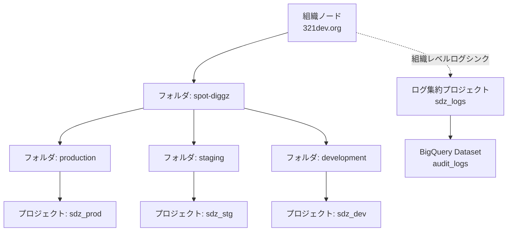
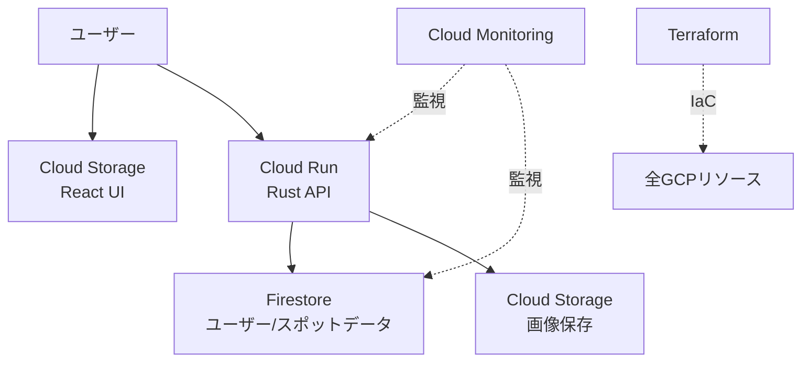
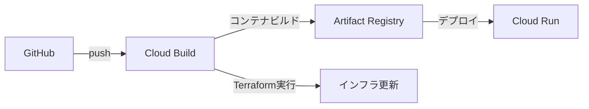
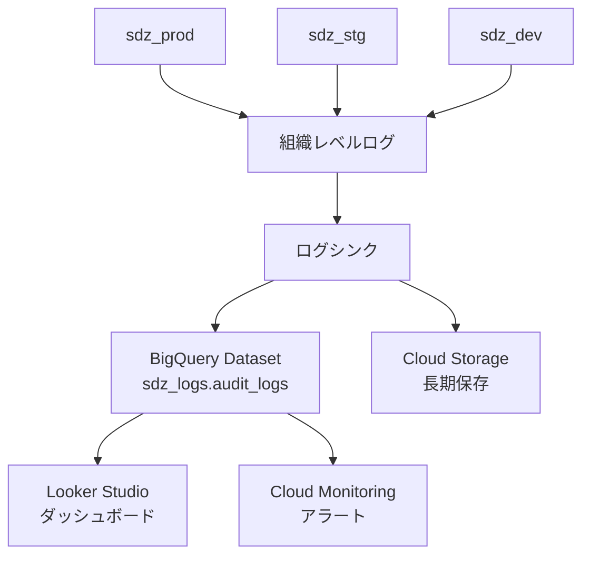

# AGENTS.md 

必ず日本語で回答してください。

## Agent運用ルール

- 再利用できるコマンドは、実行の意味と一緒に`README.md`の「使うコマンド一覧」へ追記すること。
- 課題整理・ドキュメント整理・起票支援は、以下のCODEXルールに従うこと。
- 実装変更後は、`.github/workflows/ci.yml` 記載のテストがローカルで全てPASSすることを確認してからPR作成に進むこと。

## CODEX ルール（課題整理・起票・ドキュメント整理）

### トリガーとなる指示
- 「starで課題として起票して」→ STAR形式で起票内容を作成
- 「4fで事実ベースで起票して」→ 4F形式で起票内容を作成
- 「aiddルールとして追加して」→ AGENTS.md に追加するルールとして整形
- 「docsとして追加して」→ docs/ に追加する仕様/事実として整形

### 起票先プロジェクト
uechikohei/spot-diggz

### フォーマット選択
- 未来の話/検討/要件整理 → STAR
- 既に発生した障害/技術調査 → 4F
- STAR/4F以外が適切な場合は「STAR/4F以外の形式が適切」と明記し理由とテンプレートを提示

### STAR テンプレート
```
## STAR

**Situation:(状況・背景)**
1,2行程度でなるべく簡潔な表現で整理

**Task:(目的・解決すべき課題)**
1,2行程度でなるべく簡潔な表現で整理

**Action:(実施する行動)**
1,2行程度でなるべく簡潔な表現で整理

**Result:(期待される結果)**
1,2行程度でなるべく簡潔な表現で整理

## 課題
（必要に応じて）

## 補足や資料URL
（必要に応じて）
```

### 4F テンプレート
```
## 4F

**Fact:(観測事実のみ)**
1,2行程度でなるべく簡潔な表現で整理

**Find:(調査で分かったこと)**
1,2行程度でなるべく簡潔な表現で整理

**Fix:(実施した対応内容)**
1,2行程度でなるべく簡潔な表現で整理

**Future:(再発防止・追加対応・教訓)**
1,2行程度でなるべく簡潔な表現で整理

```

### 起票時の必須設定
- Title: 1行
- Body: STARまたは4F
- label: `planning`または`troubleshooting`または`design`
- Status: Projectの運用ルールに合わせる
- Priority: 本リポジトリは P0/P1/P2 を使用
- Start date: 起票日
- Target date: 原則未設定（4Fで完了済みなら完了日設定可）

### ラベル運用
- `troubleshooting`, `knowledge`, `design`を推奨

### 既存課題の重複回避
- Project/Issueの既存情報と重複しないよう確認し、必要なら結合提案する

### 4F参照の優先
- 動作テスト異常・エラーログ・障害調査の際は、`4f`/`knowledge-base`/`troubleshooting` ラベル付きIssueを優先的に参照して過去事象を確認する

### 期待される出力
- title / body / 推奨ラベル / 推奨Status・Priority / 推奨Start・Target date / `gh` コマンド例

## プロジェクト概要

### 背景
- 既存システム：Ruby on Railsベースのスケートスポット検索アプリケーションSkateSpotSearch（5年前に開発）
- リプレイス目的：ソフトウェアエンジニアの実力向上とモダンな技術スタックでの再構築
- 機能要件：既存機能を大幅に変更せず、技術的負債の解消と保守性向上を図る

### プロジェクト目標
1. **技術スキル向上**: バックエンド（Rust）、フロントエンド（TypeScript/React）の習得
2. **システム設計経験**: インフラアーキテクト、運用、監視、保守の実践
3. **セキュリティ強化**: セキュリティベストプラクティスの適用
4. **DevOps実践**: CI/CD、コンテナ化、自動化の実装
5. **総合的役割経験**: プロジェクトリーダー、SE、システムエンジニアの統合的経験

## 技術選定

### バックエンド
- **言語**: Rust
- **アプローチ**: スクラッチ実装（フレームワーク非使用）

**選定理由**:
- **パフォーマンス**: メモリ安全性と高速な実行速度
- **学習効果**: 業務Python経験からのステップアップ
- **深い理解**: 低レベルからのWebサーバー実装理解

### フロントエンド
- **言語**: TypeScript
- **フレームワーク**: React

**選定理由**:
- **型安全性**: 静的型付けによるバグ減少と開発効率向上
- **エコシステム**: Reactの豊富なライブラリとコミュニティ
- **将来性**: 業界デファクトスタンダード技術の習得

### インフラ・クラウド戦略

**選定プラットフォーム**: Google Cloud Platform (GCP)

**選定理由**:
- **コスト効率**: Cloud Run/Firestoreの無料枠活用
- **運用負荷削減**: サーバーレス設計による自動スケーリング
- **IaC対応**: Terraform連携による効率的なインフラ管理
- **企業レベル学習**: 組織・フォルダ階層によるエンタープライズ設計の実践

### リソース階層設計（エンタープライズレベル学習）

**設計思想**: 個人開発でもエンタープライズレベルの設計パターンを学習し、将来のキャリアに活用可能な実践的スキルを獲得

**推奨リソース階層**:


**階層設計の詳細**:

| 階層 | 命名例 | 目的・役割 | 学習価値 |
|------|--------|------------|----------|
| **組織ノード** | `321dev.org` | 全リソースのルート・ポリシー統括（Workspace自動作成） | 企業環境の権限管理モデル学習 |
| **アプリフォルダ** | `spot-diggz` | アプリケーション単位の論理グループ化 | マルチプロジェクト運用の実践 |
| **環境フォルダ** | `production`/`staging`/`development` | 環境ごとのポリシー・権限分離 | 本格的な環境管理手法の習得 |
| **プロジェクト** | `sdz-{env}` | 実リソースのデプロイ単位 | コスト管理・リソース分離 |
| **ログ集約** | `sdz_logs` | 組織全体のログ・監査データ集約 | セキュリティ監視の実装 |

### 組織設計の実装価値

**1. 統合ログ管理・監査体制**:
```bash
# 組織レベルでの全ログ集約
gcloud logging sinks create org-audit-sink \
  bigquery.googleapis.com/projects/sdz_logs/datasets/audit_logs \
  --organization=$ORG_ID \
  --include-children \
  --log-filter='protoPayload.methodName:("google.cloud.*")
AND severity>=INFO'
```

**2. セキュリティポリシー一元管理**:
```bash
# 組織ポリシー例：全プロジェクトでShielded VM強制
gcloud resource-manager org-policies enable-enforce \
  compute.requireShieldedVm \
  --organization=$ORG_ID

# 外部IPアクセス制限
gcloud resource-manager org-policies deny \
  compute.vmExternalIpAccess \
  --folder=production-folder-id
```

**3. 環境別IAM権限制御**:
```bash
# 開発者は開発環境のみアクセス可能
gcloud resource-manager folders add-iam-policy-binding development-folder \
  --member=user:developer@example.com \
  --role=roles/editor

# 本番環境は限定的なアクセス
gcloud resource-manager folders add-iam-policy-binding production-folder \
  --member=user:admin@example.com \
  --role=roles/viewer
```

**技術構成**:
- **バックエンド**: Cloud Run（Rust実装、コンテナベース）
- **フロントエンド**: Cloud Storage静的ホスティング（React SPA）
- **データベース**: Firestore（NoSQLドキュメントDB）
- **ストレージ**: Cloud Storage（画像・静的ファイル）
- **監視・ログ**: Cloud Monitoring + Cloud Logging
- **CI/CD**: Cloud Build + GitHub Actions

**コスト最適化戦略**:

| サービス | 無料枠 | 想定spot-diggz使用量 |
|----------|--------|------------------|
| Cloud Run | 月200万リクエスト | 個人アプリレベル |
| Firestore | 1GB + 5万回/日書き込み | スケートスポットデータ |
| Cloud Storage | 5GB | スポット画像・静的ファイル |
| Cloud Build | 月120分 | CI/CDパイプライン |

**4. 階層別コスト管理**:
```bash
# フォルダレベルでの予算設定
gcloud billing budgets create \
  --billing-account=BILLING_ACCOUNT_ID \
  --display-name="spot-diggz-Production-Budget" \
  --budget-amount=500 \
  --threshold-rule=percent=50 \
  --threshold-rule=percent=90 \
  --filter-folders=production-folder-id
```

**組織設計のメリット（321dev.org環境での学習効果）**:

| メリット | 実装内容 | 学習効果 |
|----------|----------|----------|
| **監査ログ一元化** | 組織レベルログシンク | インシデント調査・コンプライアンス対応 |
| **権限モデル実践** | フォルダ別IAM設定 | エンタープライズ権限管理の理解 |
| **ポリシー統制** | 組織ポリシー適用 | セキュリティガバナンスの実装 |
| **環境分離** | フォルダベース環境管理 | 本格的なDevOps環境の構築 |
| **コスト可視化** | 階層別予算・アラート | 企業レベルのコスト管理手法 |

### 321dev.org環境の前提条件

**完了済み**:
- ✅ Google Workspace契約 (321dev.org)
- ✅ 独自ドメイン取得 (321dev.org)
- ✅ 組織管理者権限 (uechi@321dev.org)
- ✅ 組織ノード自動作成 (321dev.org)

**セットアップ手順**:
1. **Google Workspace契約** ✅ 完了
2. **組織ノード確認** (321dev.org 自動作成済み)
3. **アプリフォルダ作成** (spot-diggz フォルダ作成)
4. **環境フォルダ構築** (production/staging/development)
5. **プロジェクト作成・配置**
6. **ログ集約設定**
7. **組織ポリシー適用**

**コスト監視**:

```bash
# 予算アラート設定
gcloud budgets create \
  --billing-account=BILLING_ACCOUNT_ID \
  --display-name="spot-diggz-prod-budget" \
  --budget-amount=1000 \
  --threshold-rule=percent=50 \
  --threshold-rule=percent=90 \
  --notification-rule=pubsub-topic=projects/sdz_logs/topics/budget_alerts
```

**命名規則**:

| リソース種別 | 命名パターン | 例 |
|-------------|-------------|----|
| **GCPプロジェクト** | `sdz_{env}` | `sdz_dev`, `sdz_prod` |
| **Cloud Run** | `sdz_{env}_api` | `sdz_dev_api` |
| **Cloud Storage** | `sdz_{env}_{type}_bucket` | `sdz_prod_img_bucket` |
| **Firestore** | `sdz_{type}` | `sdz_user`, `sdz_spot` |
| **Service Account** | `sdz_{env}_{type}_sa` | `sdz_dev_api_sa` |
| **サービス名** | `kebab-case` | `spot-diggz` |

### 🏗️ 技術スタック別命名規約

#### TypeScript/React（フロントエンド）
```typescript
// 変数・関数: camelCase + sdz プレフィックス
const sdzUserProfile = getUserProfile();
const sdzApiClient = new SdzApiClient();

// 型・コンポーネント: PascalCase + Sdz プレフィックス
interface SdzSpotData { spotId: string; }
const SdzSpotCard = () => { /* */ };

// 定数: SCREAMING_SNAKE_CASE + SDZ プレフィックス
const SDZ_API_BASE_URL = 'https://api.spot-diggz.321dev.org';

// ファイル名
SdzSpotCard.tsx, sdz-api-client.ts
```

#### Rust（バックエンド）
```rust
// 変数・関数: snake_case + sdz プレフィックス
let sdz_user_profile = get_user_profile();
let sdz_config = SdzConfig::new();

// 構造体・enum: PascalCase + Sdz プレフィックス  
struct SdzSpotData { spot_id: String }
enum SdzSpotType { Park, Street, Bowl }

// 定数: SCREAMING_SNAKE_CASE + SDZ プレフィックス
const SDZ_MAX_SPOTS: usize = 100;

// ファイル名・モジュール
sdz_spot_service.rs, sdz_models.rs
```

#### Terraform（Infrastructure）
```hcl
# リソース名: snake_case + sdz プレフィックス
resource "google_cloud_run_service" "sdz_api" {
  name = "sdz-${var.environment}-api"
}

# 変数: snake_case + sdz プレフィックス
variable "sdz_environment" { type = string }
variable "sdz_project_id" { type = string }

# ファイル名
sdz_cloud_run.tf, sdz_firestore.tf
```

### 🚫 技術別制約事項

| 技術 | 使用不可 | 理由 | 正解例 |
|------|----------|------|--------|
| **TypeScript** | `user-profile` | ハイフンは演算子 | `userProfile` |
| **Rust** | `user-profile` | ハイフンは演算子 | `user_profile` |
| **Terraform** | `sdz-api` | アンダースコアのみ | `sdz_api` |
| **All** | `123user` | 数字開始不可 | `user123` |

### 🎯 命名一貫性の原則

1. **技術準拠**: 各言語の慣習に従う
2. **SDZブランド**: 全識別子にsdz/Sdzプレフィックス
3. **可読性優先**: 略語より明確な名前
4. **制約遵守**: 言語固有の制限を事前考慮

**環境構成**:

| 環境 | 用途 | spot-diggz特徴 |
|------|------|---------------|
| `dev` | 開発環境 | スポットデータテスト・ローカル開発 |
| `stg` | ステージング | UI/UXテスト・リリース前検証 |
| `prod` | 本番環境 | 実ユーザー向けspot-diggz運用 |

### Infrastructure as Code（Terraform）

**階層対応ディレクトリ構成**:
```
web/resources/
├── organization/          # 組織・フォルダ管理
│   ├── main.tf           # 組織ノード・フォルダ定義
│   ├── policies.tf       # 組織ポリシー
│   └── logging.tf        # 組織レベルログシンク
├── modules/
│   ├── environment/      # 環境別モジュール
│   ├── folder/          # フォルダ作成モジュール
│   └── project/         # プロジェクト作成モジュール
├── environments/
│   ├── dev/             # 開発環境（フォルダ配下）
│   ├── stg/             # ステージング環境
│   └── prod/            # 本番環境（フォルダ配下）
├── shared/              # 共有リソース
│   └── logging/         # ログ集約プロジェクト
└── main.tf              # ルートモジュール
```

**組織・フォルダ管理例**:
```hcl
# organization/main.tf
# 組織ID取得 (321dev.org ドメインから自動生成)
data "google_organization" "org" {
  domain = "321dev.org"
}

resource "google_folder" "spot-diggz" {
  display_name = "spot-diggz"
  parent       = data.google_organization.org.name
}

resource "google_folder" "production" {
  display_name = "production"
  parent       = google_folder.spot-diggz.name
}

resource "google_folder" "staging" {
  display_name = "staging"
  parent       = google_folder.spot-diggz.name
}

resource "google_folder" "development" {
  display_name = "development"
  parent       = google_folder.spot-diggz.name
}

# プロジェクト作成（フォルダ配下）
module "sd_dev" {
  source      = "./modules/environment"
  env_name    = "dev"
  project_id  = "sd-dev"
  folder_id   = google_folder.development.folder_id
  region      = "asia-northeast1"
}

module "sd_prod" {
  source      = "./modules/environment"
  env_name    = "prod"
  project_id  = "sd-prod"
  folder_id   = google_folder.production.folder_id
  region      = "asia-northeast1"
}
```

**組織ポリシー管理**:
```hcl
# organization/policies.tf
# 321dev.org組織での組織ポリシー設定
resource "google_organization_policy" "require_shielded_vm" {
  org_id     = data.google_organization.org.org_id
  constraint = "compute.requireShieldedVm"
  
  boolean_policy {
    enforced = true
  }
}

resource "google_folder_organization_policy" "external_ip_deny" {
  folder     = google_folder.production.name
  constraint = "compute.vmExternalIpAccess"
  
  list_policy {
    deny {
      all = true
    }
  }
}
```

### データベース設計（Firestore）

**コレクション構造**:

```javascript
// ユーザーコレクション
"sdz-user": {
  "userId": "string",
  "username": "string", 
  "email": "string",
  "profileImg": "gs://sdz_prod-img-bucket/{path}",
  "createdAt": "timestamp",
  "updatedAt": "timestamp"
}

// スケートスポットコレクション
"sdz-spot": {
  "spotId": "string",
  "name": "string",
  "description": "string",
  "location": {
    "lat": "number",
    "lng": "number",
    "address": "string"
  },
  "images": ["gs://sdz_prod-img-bucket/{path}"],
  "userId": "string", // 作成者参照
  "tags": ["park", "street", "bowl", "vert", "transition"],
  "difficulty": "beginner|intermediate|advanced|pro",
  "rating": "number",
  "features": ["ledges", "rails", "stairs", "gaps"],
  "createdAt": "timestamp",
  "updatedAt": "timestamp"
}
```

**セキュリティルール**:
```javascript
// ユーザーデータの読み書き制御
match /sdz-user/{userId} {
  allow read: if true;
  allow write: if request.auth.uid == userId;
}

// スケートスポットデータの制御
match /sdz-spot/{spotId} {
  allow read: if true;
  allow create: if request.auth != null;
  allow update, delete: if request.auth.uid == resource.data.userId;
}
```

## アーキテクチャ設計

### システム構成（更新）


### インフラ層の詳細
1. **ネットワーク設計**:
   - **VPC**: `sd-{env}-vpc`
   - **サブネット**: `sd-{env}-subnet-asia-northeast1`
   - **ファイアウォール**: 最小権限原則適用

2. **デプロイメントパイプライン**:



3. **セキュリティ設計**:
   - **サービスアカウント**: リソースごとに最小権限割り当て
   - **Secret Manager**: APIキー等のシークレット管理
   - **VPC Service Controls**: データ流出防止

### リポジトリ構成（モノレポ）
**モノレポ構成**:
```
project-root/
├── web/                   # Webアプリ（API/UI/IaC）
│   ├── api/               # バックエンド（Rust）
│   │   ├── src/
│   │   ├── Dockerfile
│   │   └── Cargo.toml
│   ├── ui/                # フロントエンド（React）
│   │   ├── src/
│   │   ├── public/
│   │   └── package.json
│   ├── resources/         # インフラ構成（Terraform）
│   │   ├── modules/        # 再利用可能モジュール
│   │   └── environments/   # 環境別設定
│   ├── scripts/           # 自動化スクリプト
│   └── sample/            # Seed用画像サンプル
├── docs/                  # プロジェクトドキュメント
├── ios/                   # iOSアプリ（予定）
├── android/               # Androidアプリ（予定）
├── .github/               # CI/CDワークフロー
└── docker-compose.yml     # ローカル開発環境
```


## セキュリティベストプラクティス

### コンテナセキュリティ
- **脆弱性スキャン**: コンテナイメージの自動スキャン
- **最小権限原則**: 必要最小限の権限でコンテナ実行
- **セキュアビルド**: マルチステージビルドによる攻撃面縮小
- **イメージ署名**: 検証済みイメージのみデプロイ許可

### アプリケーションセキュリティ

| カテゴリ | 対策 | 実装内容 |
|----------|------|----------|
| **入力検証** | サニタイゼーション | 全ユーザー入力の検証・エスケープ |
| **認証** | JWTベース | Firebase Auth / カスタムトークン |
| **通信** | HTTPS強制 | TLS 1.3 + HSTSヘッダー |
| **ブラウザ** | セキュリティヘッダー | CORS, CSP, X-Frame-Options |

### CI/CDセキュリティ

| フェーズ | ツール | 目的 |
|--------|------|------|
| **コード品質** | cargo audit, npm audit | 依存関係脆弱性スキャン |
| **コンテナ** | Trivy, Docker Bench | イメージ脆弱性スキャン |
| **シークレット** | Secret Manager | APIキー・証明書の安全管理 |
| **デプロイ** | Signed Images | 署名済みイメージのみデプロイ |

## 開発手法・ツール選定

### プロジェクト管理・ドキュメント
**使用ツール**:
- **GitHub**: Issues/Projectsで課題管理、README/docsでドキュメント管理

**運用方針**:
- 課題はGitHub Projects/Issuesで4F/STARメソッドに整理
- README/docsは確定情報のみ記載し、TODOや課題はIssueに一本化

### 開発環境
- **コンテナ化**: Docker/Docker Compose
- **バージョン管理**: Git（GitHub）
- **CI/CD**: GitHub Actions
- **コード品質**: 
  - Rust: cargo fmt, cargo clippy, cargo audit
  - TypeScript: ESLint, Prettier, type-check
  - テストカバレッジ: 80%以上目標

### 監視・運用（エンタープライズレベル設計）

#### 統合ログ管理アーキテクチャ

**ログ集約戦略**:


**ログ種別と管理戦略**:

| ログカテゴリ | 対象 | 保存期間 | 監視目的 |
|-------------|------|----------|----------|
| **監査ログ** | 全GCP API呼び出し | 3年 | コンプライアンス・インシデント調査 |
| **アプリケーションログ** | Rust API・Reactアプリ | 1年 | パフォーマンス・エラー調査 |
| **アクセスログ** | Cloud Run・Load Balancer | 6ヶ月 | ユーザー行動分析 |
| **セキュリティログ** | 不正アクセス・権限変更 | 5年 | セキュリティインシデント対応 |

**ログシンク設定実装例**:
```bash
# 321dev.org組織ID取得
ORG_ID=$(gcloud organizations list --filter="displayName:321dev.org" --format="value(name)")

# 組織レベル監査ログシンク
gcloud logging sinks create org-audit-sink \
  bigquery.googleapis.com/projects/sdz_logs/datasets/audit_logs \
  --organization=$ORG_ID \
  --include-children \
  --log-filter='protoPayload.serviceName:("cloudresourcemanager.googleapis.com" OR "iam.googleapis.com" OR "compute.googleapis.com")'

# セキュリティアラート用ログシンク
gcloud logging sinks create security-alert-sink \
  pubsub.googleapis.com/projects/sdz_logs/topics/security_alerts \
  --organization=$ORG_ID \
  --include-children \
  --log-filter='severity>=ERROR OR protoPayload.methodName:("google.iam.*")'
```

#### メトリクス・アラート管理

**統合監視メトリクス**:

| カテゴリ | メトリクス | 閾値 | アラートレベル | 対応アクション |
|----------|----------|------|------------|-------------|
| **パフォーマンス** | `api_latency` | >500ms | WARNING | パフォーマンス調査 |
| **コスト** | `firestore_reads` | >10万/日 | INFO | コスト分析トリガー |
| **可用性** | `container_restarts` | >5/分 | CRITICAL | 自動スケーリング |
| **セキュリティ** | `failed_auth_attempts` | >100/時 | WARNING | IPブロック検討 |
| **インフラ** | `disk_utilization` | >80% | WARNING | ストレージ拡張 |

#### セキュリティ監視（SIEMシステム）

**BigQueryベースセキュリティ分析**:
```sql
-- 不正アクセスパターン検出
SELECT 
  protoPayload.authenticationInfo.principalEmail,
  COUNT(*) as failed_attempts,
  ARRAY_AGG(DISTINCT protoPayload.requestMetadata.callerIp) as source_ips
FROM `sdz_logs.audit_logs.cloudaudit_googleapis_com_activity_*`
WHERE severity = 'ERROR'
  AND protoPayload.methodName LIKE '%login%'
  AND _PARTITIONTIME >= TIMESTAMP_SUB(CURRENT_TIMESTAMP(), INTERVAL 1 DAY)
GROUP BY 1
HAVING failed_attempts > 10
ORDER BY failed_attempts DESC;
```

#### 学習目的での監視設計価値

**実践スキル収得**:
- **エンタープライズ監視**: 組織レベルでの統合ログ管理実装
- **SIEM構築**: BigQueryを使った簡易SIEMシステム構築
- **コンプライアンス**: 監査ログの適切な保存・分析体制
- **DevSecOps**: セキュリティを組み込んだ運用体制の実装

## 実装計画

### Phase 1: 基盤構築
1. **組織・フォルダ階層構築**
   - ✅ Google Workspace組織確認 (321dev.org)
   - spot-diggzアプリフォルダ作成
   - 環境フォルダ階層構築 (production/staging/development)
   - 組織ポリシー設定
2. **プロジェクト環境セットアップ**
   - 各環境プロジェクト作成
   - IAM権限設定
   - ログ集約基盤構築
3. **Dockerコンテナ環境構築**
4. **CI/CDパイプライン構築**
5. **Infrastructure as Code実装**
   - Terraform組織管理モジュール
   - 環境別リソースモジュール

### Phase 2: コア機能実装
1. バックエンドAPI（Rust）
   - 認証・認可システム
   - スケートスポット管理API
   - ユーザー管理API
2. フロントエンド（React/TypeScript）
   - 認証UI
   - スポット検索・表示UI
   - ユーザープロファイルUI

### Phase 3: 高度機能・運用
1. **地図統合**:
   - **技術選定**: Mapbox GL JS (無料枠: 月5万リクエスト)
   - **実装例**:

```javascript
mapboxgl.accessToken = 'YOUR_MAPBOX_TOKEN';
const map = new mapboxgl.Map({
  container: 'map',
  style: 'mapbox://styles/mapbox/streets-v12',
  center: [139.767, 35.681], // 東京中心部
  zoom: 12
});
```

   - **コスト対策**: 無料枠超過時はOpenStreetMapへのフェイルオーバー実装
2. 検索・フィルタリング機能
3. コメント・評価システム
4. 監視・アラートシステム
5. パフォーマンス最適化

### Phase 4: 運用・保守
1. 本番環境デプロイ
2. 監視・運用手順確立
3. ドキュメント整備
4. 保守・改善計画

## 品質保証

### テスト戦略

| テストタイプ | フレームワーク/ツール | カバレッジ目標 | 実行タイミング |
|------------|-----------------|------------|-------------|
| **単体テスト** | Rust: cargo test<br/>React: Jest | 80%以上 | コミット時 |
| **統合テスト** | Docker Compose + TestContainers | 70%以上 | PR時 |
| **E2Eテスト** | Playwright | 主要シナリオ | リリース前 |
| **負荷テスト** | k6 / Artillery | 目標レスポンス | 本番デプロイ前 |

### コード品質管理

| 言語 | Linter | Formatter | その他 |
|------|--------|-----------|--------|
| **Rust** | clippy | rustfmt | cargo audit |
| **TypeScript** | ESLint | Prettier | type-check |
| **Infrastructure** | tflint | terraform fmt | tfsec |

**品質管理プロセス**:
- **コードレビュー**: GitHub Pull Request必須
- **自動チェック**: CIで品質ゲート実行
- **技術的負債**: 週次レビューと改善計画

## 学習・成長目標

### 技術面

#### プログラミングスキル
- **Rust**: メモリ管理、並行処理、エラーハンドリングの実践習得
- **TypeScript/React**: 型システム、状態管理、パフォーマンス最適化

#### エンタープライズアーキテクチャ
- **組織設計**: Google Cloud組織・フォルダ階層の実装と管理
- **リソース管理**: マルチプロジェクト環境での権限・コスト管理
- **コンプライアンス**: 監査ログの適切な保存とアクセス制御
- **ガバナンス**: 組織ポリシーとセキュリティ基準の一元管理

#### DevOps・SREスキル
- **Infrastructure as Code**: Terraformでの組織レベルリソース管理
- **監視・可観測性**: 組織全体での統合ログ管理とSIEM構築
- **コンテナセキュリティ**: 脆弱性スキャンからランタイム保護まで
- **コスト最適化**: クラウドコストの継続的監視と最適化

#### セキュリティ専門スキル
- **ゼロトラストアーキテクチャ**: ネットワークセグメンテーションとアクセス制御
- **脅威ハンティング**: BigQueryでの異常検知とパターン分析
- **インシデント対応**: セキュリティインシデントの早期発見から対応まで

### プロジェクト管理・リーダーシップ

#### エンタープライズプロジェクト管理
- **要件定義**: ビジネス要求から技術要件への落とし込み
- **アーキテクチャ設計**: スケーラビリティ、可用性、セキュリティを考慮した設計
- **リスク管理**: 技術的リスクとビジネスリスクの統合管理
- **コスト管理**: フルライフサイクルコストの見積もりと最適化

#### チームマネジメントスキル
- **ステークホルダー管理**: 経営層から開発チームまでのコミュニケーション
- **ドキュメント戦略**: 技術ドキュメントから運用手順書までの体系化
- **知識伝達**: ナレッジマネジメントとスキル伝達の仕組み化

#### 運用・保守体制
- **サービスレベル管理**: SLA/SLOの設定と継続的な改善
- **インシデント管理**: 障害対応からポストモーテムまでのプロセス整備
- **キャパシティプランニング**: システム成長とリソース計画の連動

## 開発規約

### Git コミットメッセージ
```bash
# 機能追加
feat(auth): Add user authentication system

# バグ修正  
fix(api): Resolve memory leak in spot search

# リファクタリング
ref(ui): Extract common UI components

# ドキュメント更新
docs(readme): Update setup instructions
```

### コードレビュープレフィックス

| プレフィックス | 用途 | 例 |
|-------------|------|----|
| **MUST** | 必須修正事項 | `MUST: セキュリティ修正が必要` |
| **SUGGEST** | 改善提案 | `SUGGEST: 関数名をより具体的に` |
| **ASK** | 質問・確認 | `ASK: このロジックの意図は？` |
| **NITS** | 軽微な指摘 | `NITS: 末尾のカンマが不足` |

### ブランチ戦略

| ブランチ | 用途 | マージ先 |
|-----------|------|----------|
| `main` | 本番リリース | - |
| `develop` | 開発統合 | `main` |
| `feature/*` | 機能開発 | `develop` |
| `hotfix/*` | 緊急修正 | `main` ・ `develop` |

## 重要な注意事項

### 開発指針
1. **学習優先**: 実装速度より技術的理解を重視
2. **品質確保**: 動作確認・テスト・ドキュメントを徹底
3. **セキュリティファースト**: 設計段階からセキュリティを考慮
4. **継続改善**: 定期的な振り返りとアップデート
5. **実用性**: 実際に使用可能なアプリケーションとして完成

---

## プロジェクト目標

このリプレイスプロジェクトを通じて、**現代的なWebアプリケーション開発の全工程**を経験し、エンジニアとしての**総合的な技術力向上**を目指します。

### 期待される成果

#### 技術的成果
- **プログラミングスキル**: Rust・TypeScript・GCPの実践的習得
- **エンタープライズアーキテクチャ**: 組織レベルでのクラウド設計・運用経験
- **インフラストラクチャ**: Docker・Terraform・CI/CDのマスター
- **セキュリティ実装**: ゼロトラストアーキテクチャの実装

#### キャリア向上成果
- **エンタープライズ経験**: 大規模組織での設計・運用パターンの習得
- **ガバナンス知識**: コンプライアンス・監査要件を満たすシステム設計
- **リーダーシップ**: プロジェクト管理から技術リーダーシップまでの総合経験
- **問題解決能力**: 複雑なシステム要件を技術的に解決する実践力

#### 将来性・差別化要因
- **企業レディ**: 即戦力として企業環境で活躍できる設計・運用スキル
- **スケーラビリティ**: 個人開発から企業レベルまで対応できる視野と経験
- **総合力**: フルスタック開発者＋インフラエンジニア＋セキュリティ専門家の複合スキル
